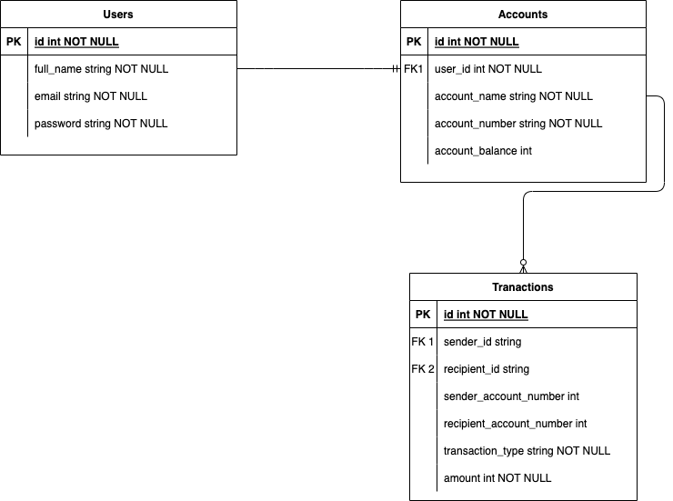

# Demo Credit

Demo Credit is a mobile lending app that requires wallet functionality. This is needed as borrowers need a wallet to receive the loans they have been granted and also send the money for repayments.

## Routes
POST /users/signup — create a user\
POST /users/login — auth a user

POST /accounts — create an account\
GET /accounts/:id/balance — get account balance\
POST /transactions/deposit — make a deposit\
POST /transactions/withdraw — make a withdrawal

POST /transactions/transfers — create a transfer\
GET /transactions — get all transactions

## To Run Locally ...
Install dependencies

```bash
npm ci

Start the Typescript Compiler in watch mode
bash
npm run watch:tsc

Run the SQL migrations 
bash
npx knex migrate:rollback
npx knex migrate:latest

Start the server
bash
npm run start:dev
```

